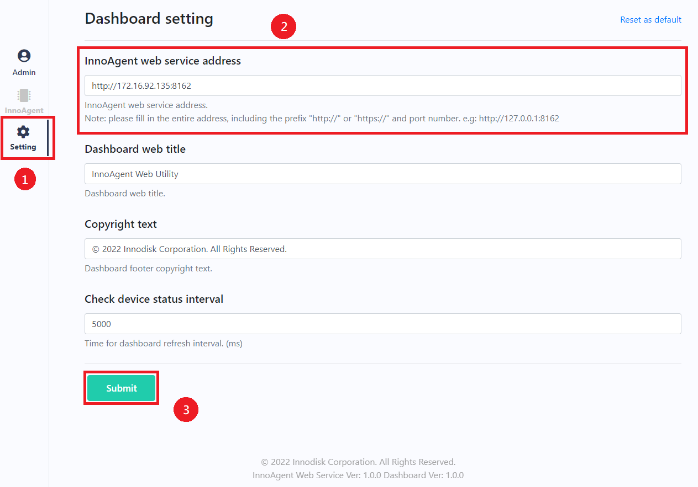

# InnoAgent Demo Dashboard

This package provides the InnoAgent dashboard and its source code.

- If you only want to use this application with docker, see the `Deploy` chapter description.

- If you want to customize or re-develop this dashboard, see the `How to customize or re-develop` chapter description.

---

---

## System requirements

- Linux (Ubuntu) or Windows
- node.js
- npm
- InnoAgent web service

Note: This package requires the InnoAgent web service as its backend service. Please set the InnoAgent Web service before using this package. For more information, please refer to the InnoAgent ReadMe document.

If you want to use the docker-compose method to execute, must have docker and docker-compose installed.

- docker compose

---

---

## Configuration

### Connect to the InnoAgent web service

Before using the InnoAgent dashboard, you must be set the "InnoAgent web service address" at the dashboard setting page.



---

---

## Deploy

### Deploy with the docker

Before run the following command, please make sure the InnoAgent dashboard docker images has been existing in export-images folder.

1. Go to the "release" folder.

   > cd release/scripts

2. Using the following script to deploy.
   - Linux
     > ./deploy.sh
   - Windows
     > ./deploy.cmd

After deployment finishes, please set up the dashboard configure to connect to the InnoAgent web service, for more information, please refer to the `Configure` chapter description.

### Deploy with the docker-compose

Docker compose can makes build docker image and deploy in one-click.

Using the following script to deploy InnoAgent Dashboard.

- Linux
  > ./install.sh
- Windows
  > ./install.cmd

After deployment finishes, please set up the dashboard configure to connect to the InnoAgent web service, for more information, please refer to the `Configure` chapter description.

---

## The script file usage

This section describes usage for another script file.

All scripts are located in the "release/scripts" directory.

## Build docker images & save images

To build docker image, using the following script.

Build the docker images.

- Linux
  > ./build-docker-images.sh
- Windows
  > ./build-docker-images.cmd

To export built docker image, using the following script.

- Linux
  > ./save-image.sh
- Windows
  > ./save-image.cmd


## Start dashboard

You can use the following script to start InnoAgent dashboard.

Note: This script for non-first-time start dashboard only! If you are first time run the InnoAgent dashboard, please follow `Deploy` section instructions.


Start InnoAgent dashboard.

- Linux
  > ./start-dashboard.sh

- Windows
  > ./start-dashboard.cmd

## Stop dashboard

You can use the following script to stop InnoAgent dashboard.

Note: This script only stop existing InnoAgent dashboard but not remove it, if you want to permanently remove it, please follow `Remove dashboard` section instructions.

Start InnoAgent dashboard.

- Linux
  > ./stop-dashboard.sh
- Windows
  > ./stop-dashboard.cmd

---

## Remove dashboard

If you want to remove the InnoAgent dashboard service, execute those command in Linux terminal.

Execute the remove script to remove InnoAgent dashboard.

- Linux
  > ./remove.sh
- Windows
  > ./remove.cmd

---

## How to customize or re-develop

All source codes are located in the "src" directory.

First, you must install dependencies package, using the following command.

> npm install

To run the project in webpack develop server, using the following command, and will run at `127.0.0.1:9996`

> npm run start

```
.
|-- dist                                                            // The build output folder
    |-- ...
|-- node_modules                                                    // The project dependencies
|   |-- ...
|-- release                                                         // The docker build file folder
|   |-- ...
|-- src                                                             // All source codes
|   |-- assets
|   |   |-- ...
|   |-- html                                                        // Page layouts
|   |   `-- pages
|   |       |-- ...
|   |-- js
|   |   |-- components                                              // Components
|   |   |   |-- device                                              // Device control components
|               | -- ...
|   |   |   `-- pages                                               // Page components
|   |   |       |-- ...
|   |   |-- config                                                  // Device config file
|   |   |   |-- ...
|   |   |-- library                                                 // Shared libraries
|   |   |   |-- utils
|   |   |   |   |-- ...
|   |   |   |-- ...
|   |   |-- pages                                                   // The main page generator js
|   |   |   |-- ...
|   |   |-- ...
|   |-- style                                                       // Page stylesheets
|   |   `-- css
|   |       |-- webfonts
|   |       |   |-- ...
|   |       |-- ...
|   |-- index.html                                                  // Main html
|   `-- index.js                                                    // Main js
|-- ReadMe.md                                                       // * Current file
|-- dashboard.png
|-- favicon.ico
|-- folder.txt
|-- package-lock.json
|-- package.json
|-- release-win.cmd                                                 // Build script (Windows)
|-- release.sh                                                      // Build script (Linux)
`-- webpack.config.js

```

### Compile from the source code

1. To create the production build, using the following command.

- Windows

  > npm run releasew

- Linux OS

  > npm run releasel

2. After the release script is complete, you can build a Docker image or deploy them to Azure. For more information, see the relevant section description.
